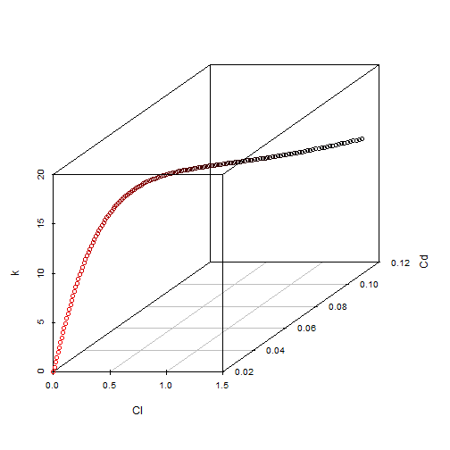
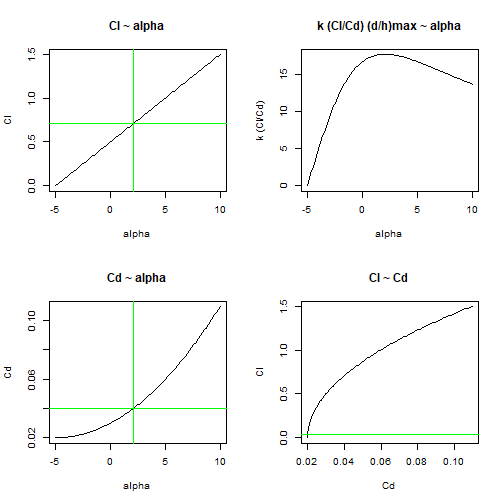
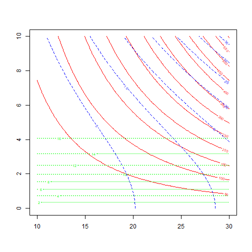
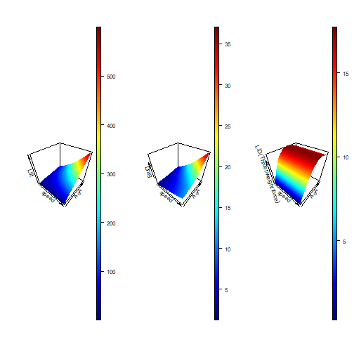
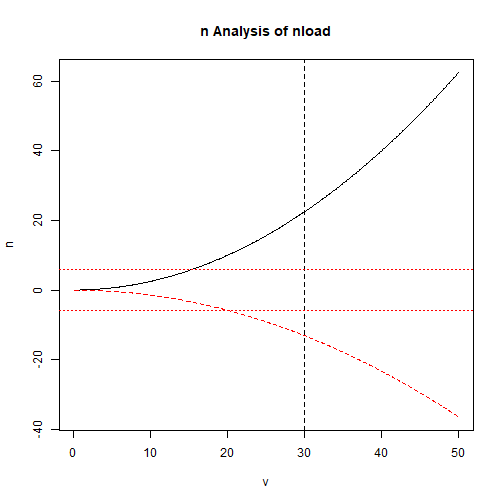
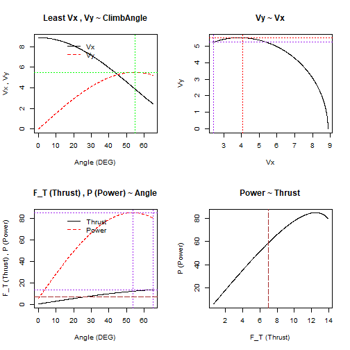

Introductions to mathematical models related to aviation
========================================================
author: Open UAV Course for Team-FW
date: 25/11/2018
autosize: true

Models to cover
========================================================

- Models to predict Aerodynamic properties
- Kinematics (Simple states/ simulations)

Before we start
========================================================
 - apply certain math with some assumptions
 - every models applied have some limitations

Software you can use to manipulate data
========================================================

1.CAE/CAD/CAM -including CFD (Computational Fluid Dynamics--NOT COLOURED fluild dynamics); FEA(Finite element analysis,for heat transfer analysis, modual, stress and shape optimization)
Dassault; ANSYS; Autodesk...  
2.Flight Simulators(Predict complexed kinetic simulations with known design parameters)
FlightGear; RealFlight; Aerofly...  
3. Widgets(handy calculators for small round of calc)
Wolfram widgets for planes; eCalc ...  
4. Integrated Design Tools(bringing/ connecting the aboves together)
CEASIOM; OpenVSP; Xflr5 ...  

Software package used in this presentation
========================================================


```r
require(rAviExp)
```

Go to aviexptemp.weebly.com for more info 

Predictions of aerodynamic properties (accurate to some extents)
========================================================

Let's recap.

Lift and drag are aerodynamic forces and by defn

 - Lift is the  component perpendicular to velocity (heading)
 - Drag is opposite the heading

Basic Defn
========================================================
For airplanes, the main lift source (wings), if without large sweep, can be simplified to 2D problems. Actually, because of the complexity of the system, if possible, the problems in fluid dynamic are usually degraded in dimensions.

Force and drag of lift and drag on a wing can be calculated from the 2D property of wing profiles (cross-section of the wing along y-axis). Cy,Cx for profiles are easier for calculations and data manipulations.

We are interested in the following aspects:

 - Lift
 - Drag
 - Torque
 - Lift to drag ratio

Basic Eq
========================================================
Cy(or Cl) and Cx (or Cd)have similar definitions:
$$Cl=\frac{L_{section}}{q*c}$$

Connections
========================================================
If we relate back to the other form of Bernoulli's law, when P is constant.
$$p+q=Constant$$
$$L=\frac{1}{2}*Cl*\rho*S*v^2 =q*Cl*S$$
Where q is a term for dynamic pressure(kinetic energy per unit volume of a fluid particle). We can substitute and see how the Cy equation (definition) works.

Thin airfoil theory
========================================================
We can calculate Cy/Cd by doing glider experiment (and we can prove that it is equal) but more conceptually when not stalled some wind tunnel tests suggest that Cy of wing is roughly proportional to angle of attack(AoA or Alpha). (Alpha in radians in this equation)
$$Cl_{\alpha} = Cl(\alpha) \simeq Cl_{0}+2\pi \alpha$$

Since it is linear it does not matter if we use the point with Cl=0 or Alpha=0 to locate the line as long as we get the gradent.

This is the gradient of Cl with respect to angle of attack. The alpha0 is the angle of attack when no lift is generated on the profile. We could also say the integral of the pressure on the 2D surface area (perimeter) is 0.


Meanings
========================================================
This relationship of Cl and alpha enables people to further simplify the model. As Cl at any state can be calculated when the 2Cls at alpha are measured. Also it is notable that the value of alpha0 can be estimated with empirical formula, as the property of the airfoil is affected by the 2D shape.

Thin Airfoil Theory - technical
========================================================
$$Cl = Cl_\alpha * (\alpha - \alpha_0)$$

$$Cd = Cd0 + Cdif * Cl^2$$

$$Cdif \simeq \frac{2}{\pi * AR *e}$$
e is the Oswald Spanwise Efficiency
$$e \simeq 1.78*(1-.045*AR^{0.68})-.64$$

```r
e_GAAD_M1
```

```
function(AR) 1.78*(1-.045*AR^0.68)-.64
<bytecode: 0x00000000178f9ae0>
<environment: namespace:rAviExp>
```

```r
e_type
```

```
$elliptical
[1] 1

$rectangular
[1] 0.7
```

Use it
========================================================


```r
Alpha_lin.default
```

```
[1] "Alpha_lin:Cla= 0.1 alpha0= -5 CdiF= 0.0397887313856378 Cd0= 0.02"
```

```r
a=create(Alpha_lin.default)
a
```

```
[1] "Generated from $Raw"
[1] "Alpha_lin:Cla= 0.1 alpha0= -5 CdiF= 0.0397887313856378 Cd0= 0.02"
[1] "Out : "
  alpha   Cl         Cd         k
1  -5.0 0.00 0.02000000 0.0000000
2  -4.9 0.01 0.02000398 0.4999005
3  -4.8 0.02 0.02001592 0.9992049
4  -4.7 0.03 0.02003581 1.4973191
5  -4.6 0.04 0.02006366 1.9936540
6  -4.5 0.05 0.02009947 2.4876276
[1] "......"
    alpha   Cl        Cd        k
146   9.5 1.45 0.1036558 13.98860
147   9.6 1.46 0.1048137 13.92948
148   9.7 1.47 0.1059795 13.87061
149   9.8 1.48 0.1071532 13.81200
150   9.9 1.49 0.1083350 13.75364
151  10.0 1.50 0.1095246 13.69555
```


Default(3D) plot
========================================================

```r
plot(a)
```



2D plot
========================================================


```r
lines(a)
```



Numerical Optimization
========================================================

```r
Optim(a)
```

```
$kmax
   alpha   Cl        Cd        k
72   2.1 0.71 0.0400575 17.72452

$Cdmin
  alpha Cl   Cd k
1    -5  0 0.02 0

$Clmax
    alpha  Cl        Cd        k
151    10 1.5 0.1095246 13.69555
```

For :
 - max lift coef
 - min drag
 - max L/D
 - maybe max L^(3/2)/D in the future?
 
Aiming for higher Fidelity
========================================================

Airfoil: Considering viscosity(with Re) and compressibility (with Xflr5)
<file:///D:/xflr5_6.42_win64/xflr5_6.42_win64>
wing: Dihedral/ anhedral, sweep, aspect ratio (Correction formulae)
others: using virtual wind tunnel
<https://www.simscale.com/projects/HLi148/iv_fuse1/>
 
Why are we optimizing L/D and L^(3/2)/D?
========================================================
The answer lies in the kinetic relationships

Kinematics (simple)
========================================================
Let us assume that the relation between location, velocity and acceleration follows:
And for angular momentum:
Assuming N I, N II,N III are both true

Linear approach?
========================================================
$$v=\frac{\Delta p}{\Delta t}=\frac{dp}{dt}$$
$$a=\frac{\Delta v}{\Delta t}=\frac{dv}{dt}$$
assume space and time are consistent and position is differentiable
Simmilarly
$$\omega = \frac{d \theta}{dt}$$
$$\alpha = \frac{d \omega}{dt}$$
And the connection,
$$\alpha = T/I$$
Using linear space (2D/3D)
See also:
Aircraft Control & Stability- a linear approach

Start with horizontal flying with constant speed, no rotation
========================================================
At this stage, Lift equals to weight force; Thrust equals to drag
$$L = F_G;F_T =D$$

Recall that
========================================================
$$L = q S *C_l=Cl*\rho*S*v^2/2$$
$$D= qS*C_d = Cd*\rho*S*v^2/2$$

Connection1:
========================================================
$$\frac{F_T}{F_G}=\frac{L}{D} =\frac{Cl}{Cd}$$
Arguably to really apply this set of connection we are to ignore the effect of v on Cl and Cd usage (Re and Cp corrections).

Connection 2 Operation Requirements:
========================================================
For the aircraft to maintain the state, it must provide
 - Lift
 - Thrust
As pilots can not easily change the weight force and drag is affected by the lift DESIRED, usually lift and thrust are needed to be adjusted for certain performences.

lift needed = mg, therefore,

$$Cl*\rho*S*v^2/2 = mg$$
then the requirement on v is 
$$v > \sqrt{2mg/{Cl*S*\rho}}$$
for certain v the required Cl is
$$Cl>\frac{mg}{\rho*S*v^2}$$

Connection 2 More about lift usage
========================================================
As we see from the Cl, Cd ~ AoA analysis, the maximum Cl does not occur at maximun Cl/Cd, therefore when the plane is using its max Cl it is not the most effecient.
This can be shown by analysing 2 variables at the same time, in this way. Still using the same assumption from thin airfoil theory we have.



========================================================


```r
require(plot3D)
layout(matrix(1:3,1,3))
persp3D(x=v,y=alpha,z=L,xlab = 'speed',ylab = 'AoA',zlab = 'Lift')
persp3D(x=v,y=alpha,z=D,xlab = 'speed',ylab = 'AoA',zlab = 'Drag')
persp3D(x=v,y=alpha,z=L/D,xlab = 'speed',ylab = 'AoA',zlab = 'L/D (Thrust/weight force)')
```




Connection 3 relating to structual considerations
========================================================
Load factor n is defined as the acceleration the plane experiences divided by gravity.
For people standing on the ground the load factor is 1g

In the 2D problem we mentioned above the load can be expressed as $$n=L/F_G$$
from there it is possible to create a load analysis (with respect to operation speed etc.) And with boundaries of load, kinetic density etc. workout the safety region

The structual considerations is related to load, stress and stress momentum on an object (Fusion with FEM).


```r
nload = create(load.default)
lines(nload)
```



More with simple kinetic problems
========================================================
Instead of horizontal flight we assume certain lift coefficient and drag coefficient is used to optimize flight characteristics. Then certain minimum velocity(and corresponding force and power) is required to maintain certain climb angle.

$$F_G = L*cos(\theta)+F_T*sin(\theta)$$
$$F_D = F_T*cos(\theta)-L*sin(\theta)$$
$$P = F_T*v$$
<https://www.le.ac.uk/eg/mct6/teaching/aero_lect2_2015.pdf>


```r
lines(create(theta.default))
```



With flight Simulators
========================================================

 - Simulation of dynamic systems(the way that simulation works).
 - Modifications of paramters

Thank you
========================================================
